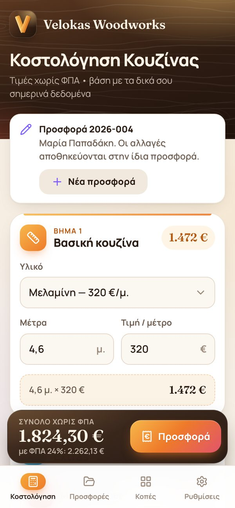
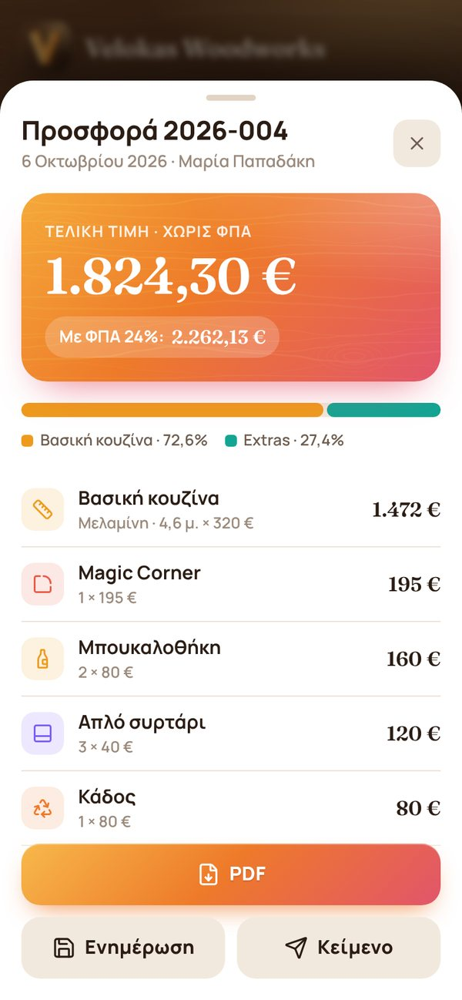
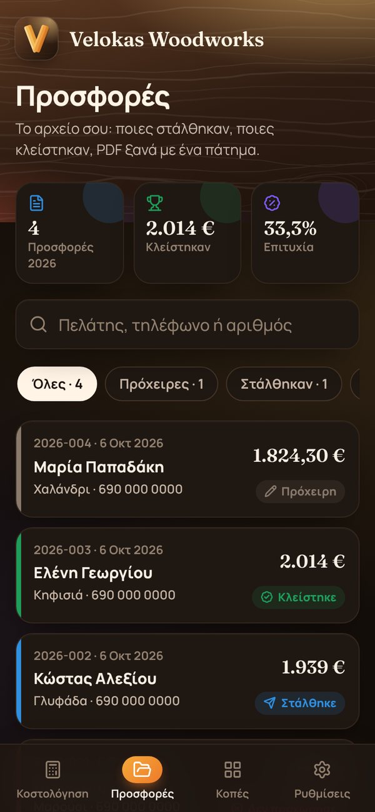
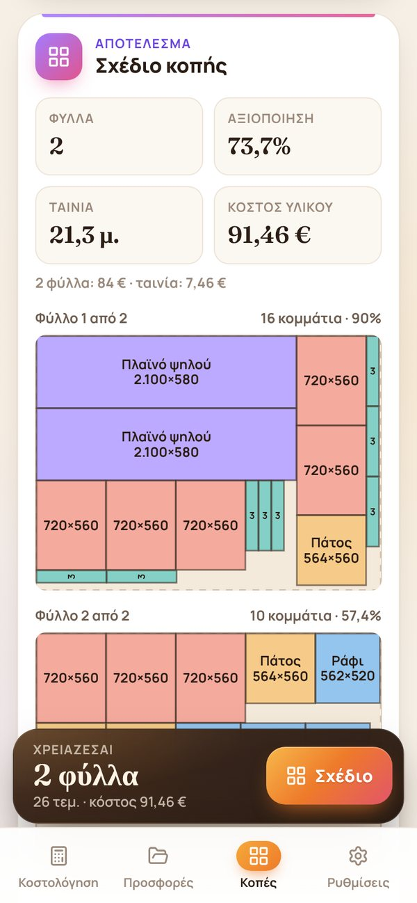
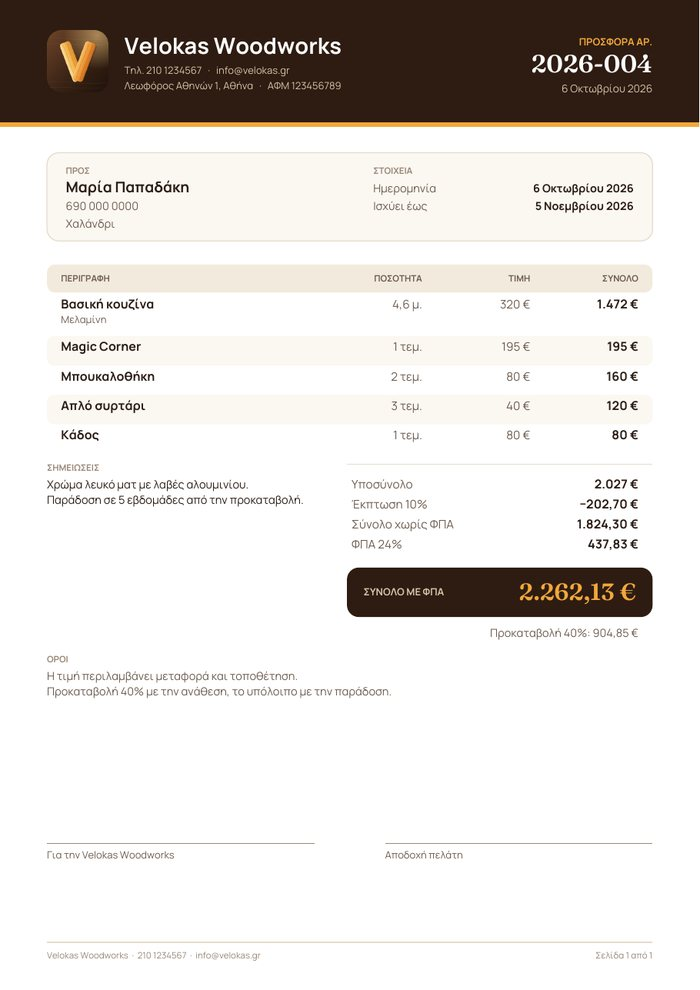
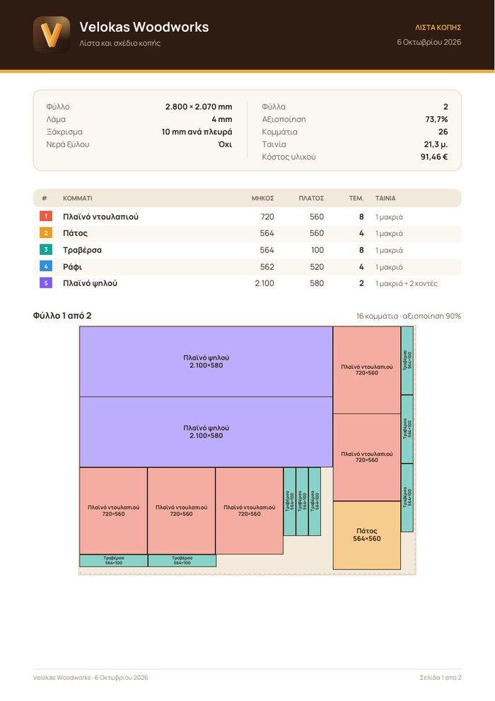

# Velokas Woodworks

A phone-first app for Velokas Woodworks, grown from Panos's kitchen-costing mockup: price a kitchen, send the customer a PDF quote, keep track of every quote, and work out how to cut the sheets. It runs entirely on Cloudflare's free tier: a Worker serves the app and a small API, and a D1 (SQLite) database stores the prices and the saved quotes.

<p>
  
  
  
  
</p>
<p>
  
  
</p>

## What it does

Four tabs along the bottom of the screen.

**Κοστολόγηση (calculator)**, open to anyone with the link:

1. **Βασική κουζίνα:** pick the material and type the metres. The price per metre comes from Settings and can be changed for a single quote.
2. **Extras:** each item has a quantity stepper and a unit price that can also be changed per quote, plus an «Άλλο extra» with its own description.
3. **Πελάτης & έκπτωση:** customer name, phone and area, a discount in % or €, and notes printed on the quote.
4. **Εσωτερική κοστολόγηση (optional):** Panos's own costs (parts, doors, hardware, countertop, labour, transport) show the profit and margin. They never appear in anything the customer sees.

The total updates live in the bar at the bottom. **Προσφορά** opens the breakdown, with three actions:

- **PDF:** an A4 quote with the logo and business details, the customer, every line, discount, VAT, deposit, how long the offer is valid, the terms and signature lines. On a phone it goes straight to Viber, email and so on through the share sheet; it can also be downloaded or printed.
- **Αποθήκευση:** saves it to the archive as `2026-001`, `2026-002`… (numbered per year). Making a PDF while logged in saves it too, so the PDF carries the number.
- **Κείμενο:** the same quote as plain text for a quick message.

Whatever is typed is kept on the phone, so a refresh doesn't lose it.

**Προσφορές (archive)**, password protected: this year's quotes, how much was closed and the success rate; search by name, phone or number; filter by status. Tapping a quote shows it and lets Panos mark it Πρόχειρη → Στάλθηκε → Κλείστηκε / Δεν προχώρησε, make its PDF again, call the customer, open it in the calculator to change it (same number), start a new quote from a copy, or delete it.

**Κοπές (cut list)** for melamine, MDF or plywood sheets: list the parts (size in mm, quantity, and which edges get banding: tap the sides of the little board). The app lays them out on as few sheets as it can, as guillotine cuts a panel saw can make, allowing for the blade and an edge trim, and optionally keeping the grain direction. It draws every sheet, adds up the banding in metres and, with prices, the material cost, and makes a **PDF για το πριόνι** for the workshop or the timber merchant. The list stays on the device.

**Ρυθμίσεις (settings)**, password protected:

- Business name, subtitle, VAT rate
- Details printed on the PDF: phone, email, address, ΑΦΜ, how many days a quote is valid, deposit %, terms
- Materials (price per metre), extras (price per piece and icon) and internal cost lines: add, rename, reprice, hide, reorder and delete, then **Αποθήκευση**

**Works offline and installs like an app.** After the first visit the app opens without internet: calculator, PDFs and cut lists work with the last prices loaded. The archive and saving quotes need a connection. On a computer, Chrome or Edge show an **Εγκατάσταση** button in the header. On a phone, use **Add to Home screen**.

Calculation:

```
base     = metres × price per metre
extras   = Σ quantity × unit price  +  other extra
subtotal = base + extras
net      = subtotal − discount        (discount: % of the subtotal, or an amount)
VAT      = net × VAT rate             (rounded to the cent)
total    = net + VAT
deposit  = total × deposit %
profit   = net − internal costs       (margin = profit ÷ net)
```

The database starts with the values from the mockup. Only «Μελαμίνη — 320 €» was visible in the material dropdown, so add the other finishes in **Ρυθμίσεις**.

## Deploy

Every push to `main` runs the tests and deploys through GitHub Actions (`.github/workflows/deploy.yml`). Setup takes a phone browser and a free Cloudflare account; no computer is needed.

1. **Cloudflare account.** Sign in at [dash.cloudflare.com](https://dash.cloudflare.com) and open **Workers & Pages** once. If it asks for a `workers.dev` subdomain, pick one; it becomes part of the app's address.
2. **Account ID.** Copy it from the **Account details** box on the Workers & Pages page. It's also the long code in the address bar right after `dash.cloudflare.com/`.
3. **API token.** Go to [My Profile → API Tokens](https://dash.cloudflare.com/profile/api-tokens) → **Create Token** → **Edit Cloudflare Workers** → **Use template**.
   - Under Permissions, choose **+ Add more** and add **Account · D1 · Edit**.
   - Set Account Resources to your account and Zone Resources to **All zones**.
   - Choose **Continue to summary** → **Create Token** and copy the token.
4. **GitHub secrets.** Add three repository secrets at [Settings → Secrets and variables → Actions](https://github.com/NinjaStore3/VelokasWoodWorks/settings/secrets/actions/new). On a phone, use the browser rather than the GitHub app.

   | Name | Value |
   | --- | --- |
   | `CLOUDFLARE_API_TOKEN` | the token from step 3 |
   | `CLOUDFLARE_ACCOUNT_ID` | the ID from step 2 |
   | `ADMIN_PASSWORD` | the password for the Settings tab; use a long one |

5. **Run it.** Open **Actions → Test and deploy → Run workflow**, or push to `main`.
   - The first run creates the `velokas-db` database, deploys the app and fills the database with the starting prices.
   - The run's summary page shows the link, `https://velokas-woodworks.<your-subdomain>.workers.dev`.

To change the Settings password later, update the `ADMIN_PASSWORD` secret and run the workflow again. That also signs every device out. For your own domain, go to Worker → Settings → Domains & Routes in Cloudflare.

On Panos's phone, open the link and choose **Add to Home screen** (Chrome menu, or Safari's Share button). It gets its own app icon, opens full screen and works without internet. On a computer, open the link in Chrome or Edge and press **Εγκατάσταση** at the top.

### Deploying from a computer instead

With [Node.js](https://nodejs.org) 20 or newer:

```bash
npm install
npx wrangler login                     # opens the browser to authorise Wrangler
npm run deploy                         # deploys, then applies database migrations
npx wrangler secret put ADMIN_PASSWORD # first time only
```

## Local development

```bash
npm install
cp .dev.vars.example .dev.vars   # set a local admin password in it
npm run db:migrate:local         # creates a local SQLite copy of the database
npm run dev                      # http://localhost:8787
```

```bash
npm test          # unit tests + API tests against a real local Worker and database
npm run test:unit # unit tests only (no Worker)
```

There is no build step. Files in `public/` are served as they are. Two generated files are committed, so only rebuild them after changing their inputs:

```bash
npm run icons     # public/icons.svg, after editing the icon lists in scripts/build-icons.mjs
npm run vendor    # public/vendor/pdf.js (pdf-lib + fontkit), after updating either package
```

## Project layout

```
public/                 the app (plain HTML, CSS and JS modules)
  index.html
  css/app.css           design tokens, light and dark themes
  sw.js                 service worker: offline copy of the app
  js/app.js             tabs, start-up
  js/calc.js            pricing maths, the quote document, Greek formatting (pure, tested)
  js/calculator.js      Κοστολόγηση tab
  js/quotes.js          Προσφορές tab (archive)
  js/cuts.js            Κοπές tab
  js/cutlist.js         sheet cutting optimiser and banding total (pure, tested)
  js/cutplan.js         cut plan from the tab's inputs, labels (pure, tested)
  js/settings.js        Ρυθμίσεις tab
  js/session.js         admin login shared by the tabs
  js/pdf-common.js      PDF fonts, colours and drawing helpers
  js/pdf-quote.js       the quote PDF
  js/pdf-cuts.js        the cut plan PDF
  js/pdf-share.js       "PDF ready" sheet: share, download, print
  js/pwa.js             service worker registration, install button
  js/icons.js           icon list for the picker, colour helper
  icons.svg             Lucide icon sprite (generated by `npm run icons`)
  vendor/pdf.js         pdf-lib + fontkit bundle (generated by `npm run vendor`)
  fonts/pdf/            fonts embedded in PDFs (Greek included)
  _headers              security headers (CSP etc.) for static files
src/                    the Worker (API)
  worker.js             routing and error handling
  config.js             read and save settings in D1
  quotes.js             the quote archive in D1
  auth.js               admin login, sessions, password-guessing throttle
  validate.js           validation of settings and quotes (pure, tested)
migrations/             D1 schema and starting data
tests/                  node:test suites
wrangler.jsonc          Cloudflare configuration
```

### API

| Method | Path | Access | Purpose |
| --- | --- | --- | --- |
| GET | `/api/config` | public | Active materials, extras, cost lines, VAT |
| GET | `/api/admin/session` | public | Is a password configured, is this browser logged in |
| POST | `/api/admin/login` | public | `{ "password": "…" }` → session cookie |
| POST | `/api/admin/logout` | admin | End the session |
| GET | `/api/admin/config` | admin | Everything, including hidden items |
| PUT | `/api/admin/config` | admin | Replace the settings (validated, versioned) |
| GET | `/api/admin/quotes` | admin | Saved quotes, newest first (summaries) |
| POST | `/api/admin/quotes` | admin | Save a new quote; it gets the next number of its year |
| GET | `/api/admin/quotes/:id` | admin | One quote: the customer document and the form state |
| PUT | `/api/admin/quotes/:id` | admin | Change a quote (number and status stay) |
| PATCH | `/api/admin/quotes/:id` | admin | `{ "status": "draft" \| "sent" \| "accepted" \| "rejected" }` |
| DELETE | `/api/admin/quotes/:id` | admin | Delete a quote |

Prices are stored as integer cents. Saving settings sends the version the editor loaded; if another device saved in between, the API answers 409 instead of overwriting. Quote totals are always worked out again on the server from the lines, so a saved quote adds up whatever the browser sent. Quote numbers follow the year in Greece (Europe/Athens).

### Changing the database

Add a new numbered file such as `migrations/0003_something.sql`, try it locally with `npm run db:migrate:local`, then push to `main`. The deploy applies it right after the new code goes live; until then the API answers 503 for anything that needs the new tables, so keep each change compatible with the code before it.

## Security

- Admin sessions use a random token in an `HttpOnly; Secure; SameSite=Strict` cookie, valid for 30 days. Only a SHA-256 hash of the token is stored.
- After 10 wrong passwords from one IP within 15 minutes, logins are refused.
- State-changing requests must be same-origin JSON. Static files get a strict Content Security Policy.
- Saved quotes (with customers' names and phones) are only reachable with the admin login. The offline copy never stores admin data: the service worker skips `/api/`, and logging out clears the archive from the screen.
- PDFs are made on the device; nothing is uploaded. The cut list stays in the browser's storage.
- To change the password, update the `ADMIN_PASSWORD` secret and redeploy. This signs every device out.

## Free tier

Requests for static files are free and unlimited. The free Workers plan allows 100,000 API requests per day; opening the app makes about one. D1 allows 5 million row reads and 100,000 row writes per day, and 5 GB of storage, which is millions of quotes. PDFs and cut plans are made on the device, so they cost nothing. This app uses a tiny fraction of any of it.

## Credits

Icons: [Lucide](https://lucide.dev) (ISC). Fonts: Manrope and Fraunces (SIL Open Font License, see `public/fonts/`). PDFs: [pdf-lib](https://pdf-lib.js.org) and @pdf-lib/fontkit (MIT, see `public/vendor/LICENSES.txt`).
