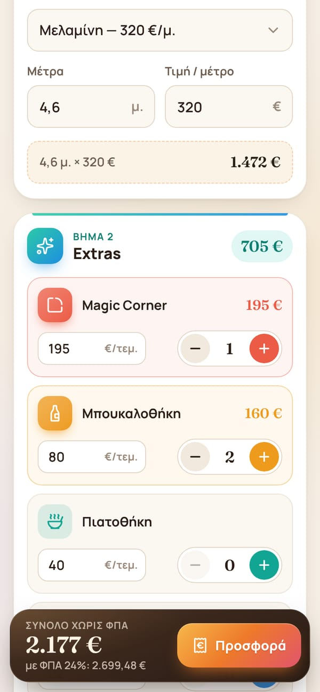
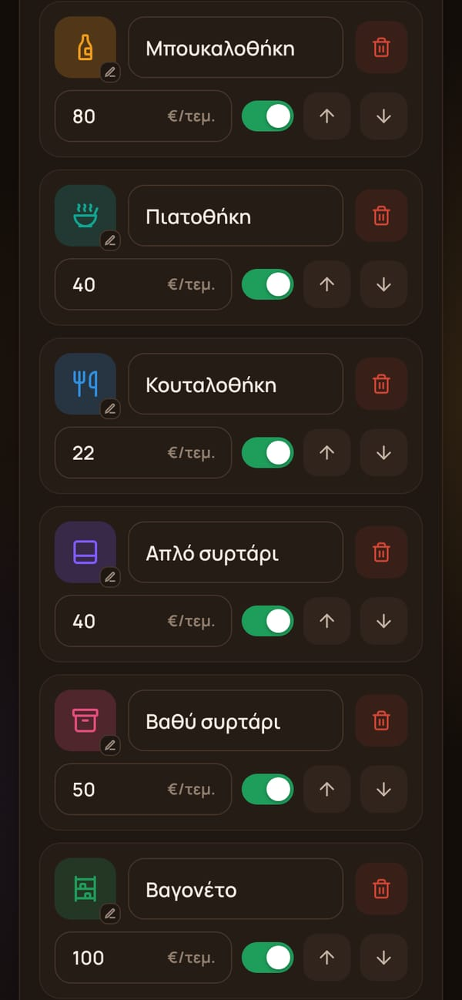

# Velokas Woodworks · Κοστολόγηση Κουζίνας

A phone-first kitchen cost calculator for Velokas Woodworks, built from Panos's mockup. It runs entirely on Cloudflare's free tier: a Worker serves the app and a small API, and a D1 (SQLite) database stores the prices.

<p>
  
  
  
  
</p>

## What it does

**Κοστολόγηση (calculator tab)** — open to anyone with the link:

1. **Βασική κουζίνα:** pick the material and type the metres. The price per metre comes from Settings and can be changed for a single quote.
2. **Extras:** each item has a quantity stepper and a unit price that can also be changed per quote, plus an «Άλλο extra» amount.
3. **Εσωτερική κοστολόγηση (optional):** Panos's own costs (parts, doors, hardware, countertop, labour, transport) show the profit and margin. These are never included in the quote he sends.

The total updates live in the bar at the bottom. **Προσφορά** opens a breakdown with VAT, and **Αποστολή / Αντιγραφή** shares the quote as text (Viber, Messenger, email). Whatever is typed is kept on the phone, so a refresh doesn't lose it. If the network drops, the app falls back to the last prices it loaded.

**Ρυθμίσεις (settings tab)** — password protected:

- Business name, subtitle, VAT rate
- Materials (price per metre), extras (price per piece and icon) and internal cost lines
- Add, rename, reprice, hide or show, reorder and delete, then press **Αποθήκευση**

Calculation, all amounts excluding VAT:

```
base   = metres × price per metre
extras = Σ quantity × unit price  +  other extra
total  = base + extras            (VAT is shown on top of this)
profit = total − internal costs   (margin = profit ÷ total)
```

The database starts with the values from the mockup. Only «Μελαμίνη — 320 €» was visible in the material dropdown, so add the other finishes in **Ρυθμίσεις**.

## Deploy (first time)

You need [Node.js](https://nodejs.org) 20 or newer and a free Cloudflare account.

```bash
git clone https://github.com/NinjaStore3/VelokasWoodWorks.git
cd VelokasWoodWorks
npm install

npx wrangler login                     # opens the browser to authorise Wrangler
npm run deploy                         # creates the database, deploys, sets up the tables
npx wrangler secret put ADMIN_PASSWORD # choose the Settings password
```

- `npm run deploy` creates a D1 database called `velokas-db` the first time and links it to the Worker. If Wrangler asks about creating the database or a `workers.dev` subdomain, accept. It may write the new `database_id` into `wrangler.jsonc`; commit that change.
- The app is then live at `https://velokas-woodworks.<your-subdomain>.workers.dev`. For your own domain, go to Worker → Settings → Domains & Routes.
- The password can also be set in the dashboard: **Workers & Pages → velokas-woodworks → Settings → Variables and Secrets → Add → Secret**, named `ADMIN_PASSWORD`. Use a long one; the Settings tab is reachable by anyone who has the link.

On Panos's phone, open the link and choose **Add to Home screen** (Chrome menu, or Safari's Share button). It gets its own app icon and opens full screen.

### Updating

```bash
git pull
npm run deploy
```

`npm run deploy` deploys the code and then applies any new files in `migrations/`.

### Optional: deploy automatically on every push

In the Cloudflare dashboard: **Workers & Pages → velokas-woodworks → Settings → Build → Connect** to this GitHub repository, and set the deploy command to `npm run deploy`. The token Cloudflare generates for builds has no D1 permission by default. Give it **Account · D1 · Edit** under **My Profile → API Tokens**, or select your own token in the build settings. Without that permission, migrations can't run during the build.

## Local development

```bash
npm install
cp .dev.vars.example .dev.vars   # set a local admin password in it
npm run db:migrate:local         # creates a local SQLite copy of the database
npm run dev                      # http://localhost:8787
```

```bash
npm test          # unit tests + API tests against a real local Worker and database
npm run test:unit # unit tests only (no Worker)
```

There is no build step. Files in `public/` are served as they are.

## Project layout

```
public/                 the app (plain HTML, CSS and JS modules)
  index.html
  css/app.css           design tokens, light and dark themes
  js/calc.js            pricing maths and Greek number formatting (pure, tested)
  js/calculator.js      calculator tab
  js/settings.js        settings tab
  js/icons.js           icon list for the picker, colour helper
  icons.svg             Lucide icon sprite (generated by `npm run icons`)
  _headers              security headers (CSP etc.) for static files
src/                    the Worker (API)
  worker.js             routing and error handling
  config.js             read and save settings in D1
  auth.js               admin login, sessions, password-guessing throttle
  validate.js           validation of saved settings (pure, tested)
migrations/             D1 schema and starting data
tests/                  node:test suites
wrangler.jsonc          Cloudflare configuration
```

### API

| Method | Path | Access | Purpose |
| --- | --- | --- | --- |
| GET | `/api/config` | public | Active materials, extras, cost lines, VAT |
| GET | `/api/admin/session` | public | Is a password configured, is this browser logged in |
| POST | `/api/admin/login` | public | `{ "password": "…" }` → session cookie |
| POST | `/api/admin/logout` | admin | End the session |
| GET | `/api/admin/config` | admin | Everything, including hidden items |
| PUT | `/api/admin/config` | admin | Replace the settings (validated, versioned) |

Prices are stored as integer cents. Saving sends the version the editor loaded; if another device saved in between, the API answers 409 instead of overwriting.

### Changing the database

Add a new numbered file such as `migrations/0002_add_quotes.sql`, try it locally with `npm run db:migrate:local`, then run `npm run deploy`.

## Security

- Admin sessions use a random token in an `HttpOnly; Secure; SameSite=Strict` cookie, valid for 30 days. Only a SHA-256 hash of the token is stored.
- After 10 wrong passwords from one IP within 15 minutes, logins are refused.
- State-changing requests must be same-origin JSON. Static files get a strict Content Security Policy.
- To change the password, set the secret again. This signs every device out.

## Free tier

Requests for static files are free and unlimited. The free Workers plan allows 100,000 API requests per day; opening the app makes about one. D1 allows 5 million row reads and 100,000 row writes per day. This app uses a tiny fraction of either.

## Credits

Icons: [Lucide](https://lucide.dev) (ISC). Fonts: Manrope and Fraunces (SIL Open Font License, see `public/fonts/`).
